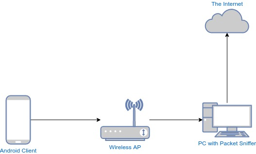
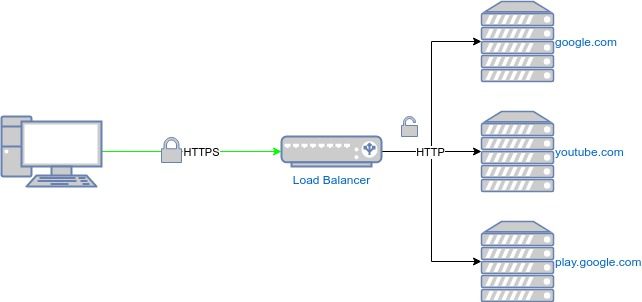

In 2015, while working at Sawa ISP, I was tasked with attempting to bypass the ban on accessing app stores such as Google Play and iTunes. Most Syrian ISPs were trying to find a solution to this problem, which deprived users of one of the core aspects of the smartphone experience. All of us had tried to bypass the ban individually using various tools and apps, but working on an individual level is different from working in an environment with tens of thousands of active users.

To set up the solution technically, we first had to install a proxy server outside Syria. Then, we routed requests to Google Play and iTunes through the proxy, so they would appear as if they were coming from outside the country. Below, I'll explain how we implemented these steps, the challenges we faced, and the solutions we applied.

## Setting Up the Proxy Server

The most commonly used software in this area is [Squid](http://www.squid-cache.org/), an open-source tool that supports a "transparent proxy" mode, where connections can be routed through it without any configuration on the user's device. This was exactly what we needed because, of course, we couldn't ask tens of thousands of customers to configure their phones to connect to our proxy server. However, the problem was that Squid does not support this mode for encrypted connections, and since all requests to Google and Apple are encrypted, using Squid would break the secure connection and stop the requests.

After some research, we found a small tool that works around this problem and acts as an intermediary between the user and Squid: [go-any-proxy](https://github.com/ryanchapman/go-any-proxy). It creates a secure connection to the target server (Google Play and iTunes in our case) through Squid by sending an [HTTP CONNECT](https://developer.mozilla.org/en-US/docs/Web/HTTP/Methods/CONNECT) request.

You can read more about how it works in the [blog post](http://blog.rchapman.org/posts/Transparently_proxying_any_tcp_connection/) by the developer of this tool.

Setting up and running the tool is very simple:

```shell
git clone https://github.com/ryanchapman/go-any-proxy.git
cd go-any-proxy
./make.bash
```

After setting up an external Squid server, let's say its address is `myownproxyserver.net` and it listens on port 80, we can run the `any_proxy` server to forward requests to the external proxy like this:

```shell
./any_proxy -l :3000 -p "myownproxyserver.net:80"
```

## Identifying and Redirecting Requests

At that time, since Apple services weren't widely used, there was no issue with forwarding all requests to the Apple network (17.0.0.0/8), which includes iTunes. This can be done by adding a simple command to the Linux firewall to forward connections before the routing stage:

```shell
iptables -t nat -A PREROUTING -p tcp -d 17.0.0.0/8 --dport 443 -j DNAT --to-destination 127.0.0.1:3000
```

With Google, since it provides many services, we wanted to send only the requests to Google Play through the proxy, not, for example, search requests or others. Since there wasn't a list of addresses or domain names specific to Google services, we had to sniff the DNS requests from an Android device while using Google Play to identify the domains and addresses being used.



To sniff DNS requests, it's enough to use `tcpdump` on a server that the requests pass through:

```shell
tcpdump -nni any port 53 and udp
```

After identifying those addresses, we added them to the firewall to be forwarded to the proxy, as we did with Apple's addresses. However, after testing, we found that the service didn't always work. Why?

Google was using an [Anycast](https://developers.google.com/speed/public-dns/faq#anycast) strategy on its DNS server, meaning that when a request for an address is made, the closest address to our geographic location is returned, and this address changes frequently. Therefore, we had to check Google Play addresses periodically and add them to the firewall list. We wrote a small program that runs every few minutes and adds the addresses to the firewall. To make this easier, we used `ipset`, which groups addresses into an easily manageable list that we named `bypass`.

```shell
GOOGLE_PLAY_IP=`nslookup android.client.googleusercontent.com`
ipset create bypass hash:ip
ipset add bypass 17.0.0.0/8
ipset add bypass $GOOGLE_PLAY_IP
iptables -t nat -A PREROUTING -p tcp -m set --set bypass -j DNAT --to-destination 127.0.0.1:3000
```

A few days later, we started receiving calls from subscribers reporting issues with YouTube and extremely slow video playback. After investigating, we found that whenever any Google service was used - not just Google Play - it would route through 4-6 addresses, no matter the requested domain or service. These addresses change periodically, and sometimes the YouTube address is the same as the Google Play services address. As a result, the program would eventually accumulate many addresses, and Google Play services would overlap with others, slowing down all services as they were routed through the proxy.

So, how does Google distinguish between requests going to Google Play and requests to YouTube? The requests are sent using the HTTP protocol, where the name of the site being requested is included in one of the HTTP header fields. However, since the requests are encrypted with SSL/TLS, only the destination server - which has the decryption key - can access this information and route the request to the appropriate service.



We needed some information to distinguish which service the user was connecting to, but this was impossible with encrypted connections. However, before encryption, the user sends an unencrypted DNS request to ask for the address of the Google service they _might use_.

We set up a simple DNS server using [dnsmasq](http://thekelleys.org.uk/dnsmasq/doc.html) to intercept DNS requests, identify the addresses of the services when users requested them, and add them to the previously used `ipset` group:

```
ipset=android.client.googleusercontent.com/bypass
```

To reduce the chance of conflicts between YouTube and Google Play addresses, we forwarded each request to a different DNS server, one to Google DNS and the other to OpenDNS:

```
server=android.client.googleusercontent.com/8.8.8.8,8.8.4.4 # Google DNS
server=yt.googleusercontent.com/208.67.222.222,208.67.220.220 # OpenDNS
```

The solution wasn't perfect - for instance, it didn't work for users who used a DNS server other than their ISP's, and there was still a small chance of service address conflicts. However, it allowed tens of thousands of users to access essential services for their smartphones. 

---

Let me know if you'd like to refine or adjust anything!
