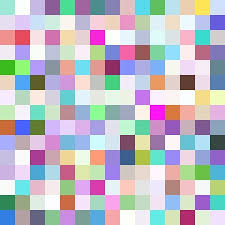

# My First Article

This is the content of my first article. You can write your article here using Markdown syntax.

## Subheading

You can add more sections, subheadings, and content as needed.

### Code Example

Here's an example of a code block:

```javascript
// In your gatsby-config.js
plugins: [
  {
    resolve: `gatsby-transformer-remark`,
    options: {
      plugins: [
        `gatsby-remark-prismjs`,
      ]
    }
  }
]
```

Here's an image



