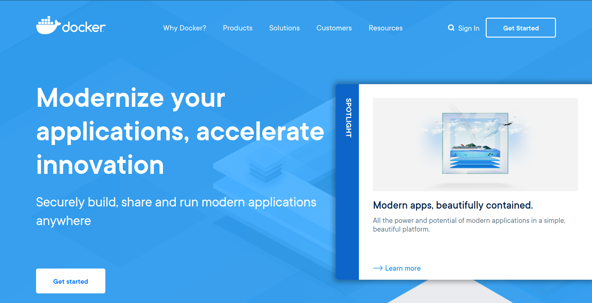

Every day, a developer lives in fear of missing the train of technological advancement. You often see them rushing to adopt new tools to ensure they stay relevant in a fast-changing field like programming. No one understands this struggle more than JavaScript developers, who seem to encounter a new framework every month.

Today, it's difficult to find a programming job that doesn't require at least basic knowledge of Docker. Since its inception, Docker has attracted a lot of attention. Although the idea behind it wasn't new, its ease of use, effective marketing, and the ecosystem it built have made it an essential tool for developers today. Docker is one of those new tools that programmers are eager to use, often before understanding the purpose and proper use of it.

When you open the homepage of Docker's website, you'll be greeted with the following statement:

**“Build, Share, and Run Modern Applications Anywhere, Securely.”**



## Build

Do you want to build an image for your application? Build it without needing to mount a folder containing the source just for the container to run it.  
Do you want to build an image for your development environment? Build it without manually installing tools inside it.  
You should treat a containerized image as something disposable, ready to be replaced with a new instance and run with the same settings, without needing to install or configure anything inside the container.

Here's an example of building a simple Node.js application:

```docker
FROM node:carbon

WORKDIR /app
COPY . /app

RUN npm ci && \
    npm run build

EXPOSE 3000

CMD npm run start
```

Do not build the application and then mount the source folder like in this example:

```shell
docker run -v /mysource:/app
```

By doing this, you're not actually building your application inside the container, and you're not using Docker correctly!

## Share

To make sharing easier, you need to reduce the size of the Docker image as much as possible. There are three things to consider:

1. Stop copying unnecessary data into the image by using a `.dockerignore` file.
2. Use smaller base images, especially those based on Alpine Linux, which are often sufficient for your needs.
3. Remove any folders unrelated to the application after building the image.

Continuing with the previous Node.js application example, in most Node projects, there is a `log` file generated by npm when an error occurs, and a `.git` folder if you are using Git for source control. Neither is needed for the application to run, so we can ignore them when building the image, resulting in the following `.dockerignore` file:

```
Dockerfile
.dockerignore
.git
*.log
```

Assuming that our application is built from a `src` folder and the result is placed in a `dist` folder, as is the case with many Node applications, we can delete the `src` folder after building the application. The Dockerfile will then look like this:

```docker
FROM node:carbon-alpine

WORKDIR /app
COPY . /app

RUN npm ci && \
    npm run build && \
    rm -rf src

EXPOSE 3000

CMD npm run start
```

Notice that I switched to the Alpine version of the previous base image.

## Anywhere

There isn't much to say here. Just follow the previous instructions, and you'll find that your application will run anywhere! Connect it to the appropriate data, and it will work just as expected.

However, beware of building the image multiple times for the same source code without any modifications. This wastes resources and could, if there's a violation of the above principles, lead to creating different versions of the same source on different machines with the same name!

Build once, run many times.

## Securely

Reducing the software within the image increases security and minimizes the potential for vulnerabilities, but you can do even more.  
Most (if not all) base images in Docker run under the root user, which is slightly risky, even though the work is done inside an isolated container. However, you can further restrict permissions by specifying a user under which Docker's commands are executed, making it much harder to do anything with the image even if your software gets compromised.

Returning to the previous example, I can run the program under the `nobody` user and group, which have minimal permissions on the image:

```docker
FROM node:carbon-alpine

WORKDIR /app
COPY . /app

RUN npm ci && \
    npm run build && \
    rm -rf src

USER nobody:nobody

EXPOSE 3000

CMD npm run start
```

It may be more complicated in some software and may require setting up a user with specific permissions, but I'll leave that to your passion for learning Linux and handling this task during image building.

Remember, **anyone can use tools; an expert knows where, how, and why to use them.**
